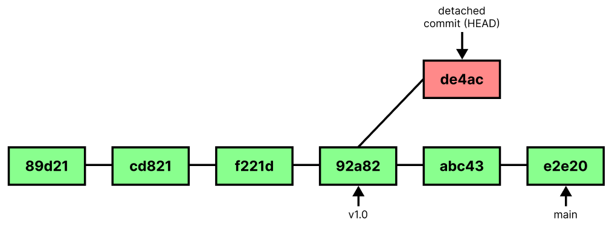

# 📋 DETACHED HEAD STATE

Checking out a commit or a tag puts the local repository in a **detached HEAD state**. It is like being on an **unnamed branch**. 

New commits **will not belong** to any branch. If we switch to another branch, we'll have a **hard time** getting back to those commits again. Detached commits will be **garbage collected** (~2 weeks).

## 📌 Three ways to preserve detached commits

| COMMAND                       | DESCRIPTION                       |
| ----------------------------- | --------------------------------- |
| `git tag temp`                | tag the commit (HEAD detached)    |
| `git branch temp_branch`      | create a branch (HEAD detached)   |
| `git checkout -b temp_branch` | create a branch and reattach HEAD |