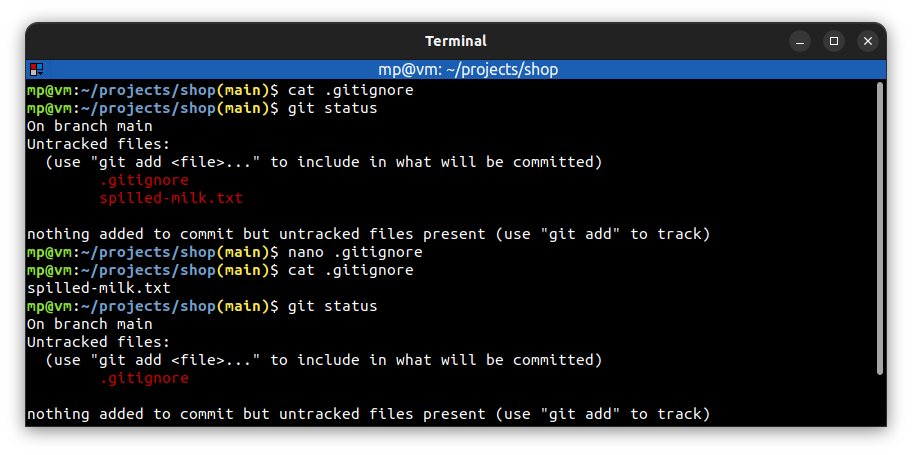

# 📋 `.gitignore`

| URL                                                                | DESCRIPTION                                         |
| ------------------------------------------------------------------ | --------------------------------------------------- |
| [github.com/github/gitignore](https://github.com/github/gitignore) | GitHub’s collection of `.gitignore` file templates. |
| [gitignore.io](https://gitignore.io)                               | `.gitignore` file generator                         |

The file `project/.gitignore` lists rules to determine which files Git should **ignore**. Changes made to ignored files will be ignored by Git.

## 📌 Pattern matching

Git understands [basic regular expressions](https://git-scm.com/docs/gitignore#_pattern_format) in `.gitignore` file.

| PATTERN                  | DESCRIPTION                                               |
| ------------------------ | --------------------------------------------------------- |
| `access.log`             | ignore `access.log` file                                  |
| `assets/videos/`         | ignore all files in `assets/videos` directory             |
| `logs/*.txt`             | ignore all files in `logs` directory that end with `.txt` |
| `*.php`</br>`!index.php` | ignore all files that end with `.php` except `index.php`  |

## 📌 Comments

You can put **comments** in `.gitignore` file after `#` character:
```md
# This is a comment
```

## 📌 Globally ignore files

| COMMAND                                                     | DESCRIPTION                                                 |
| ----------------------------------------------------------- | ----------------------------------------------------------- |
| `git config --global core.excludesfile ~/.gitignore_global` | set user specific `.gitignore` file (for all user projects) |

## 📌 Ignore tracked files

See [`git rm --cached`](../commands/GIT-RM.md)

## 📌 Example

