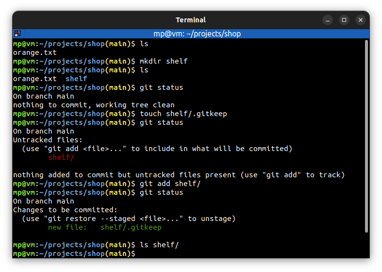

# 📋 `.gitkeep`

Git is designed to be a **file tracking system**:
- **tracks** files
- **tracks** directories with files
- **ignores** empty directories

| COMMAND                    | DESCRIPTION                                                            |
| -------------------------- | ---------------------------------------------------------------------- |
| `touch directory/.gitkeep` | creates empty invisible file which allows Git to track empty directory |

## 📌 Example

