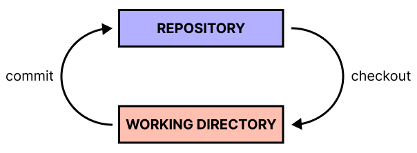
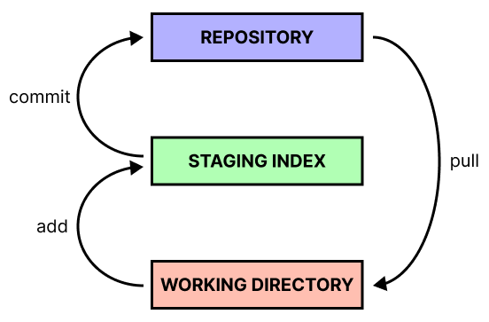

# 📋 THREE-TREE ARCHITECTURE

## 📌 Two-tree architecture

It consists of:
- **repository** - place where all the version of the files are stored
- **working directory** - place where you make your changes

They're both **trees**, because they **represent a file structure**.

## 📌 Three-tree architecture implemented in Git

It consists of:
- **repository**
- **staging index** - place where you prepare all the things that you are going to commit
- **working directory**

