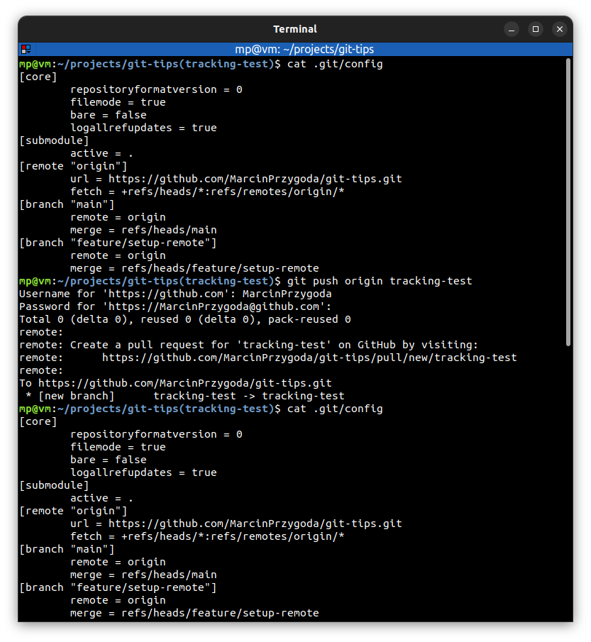
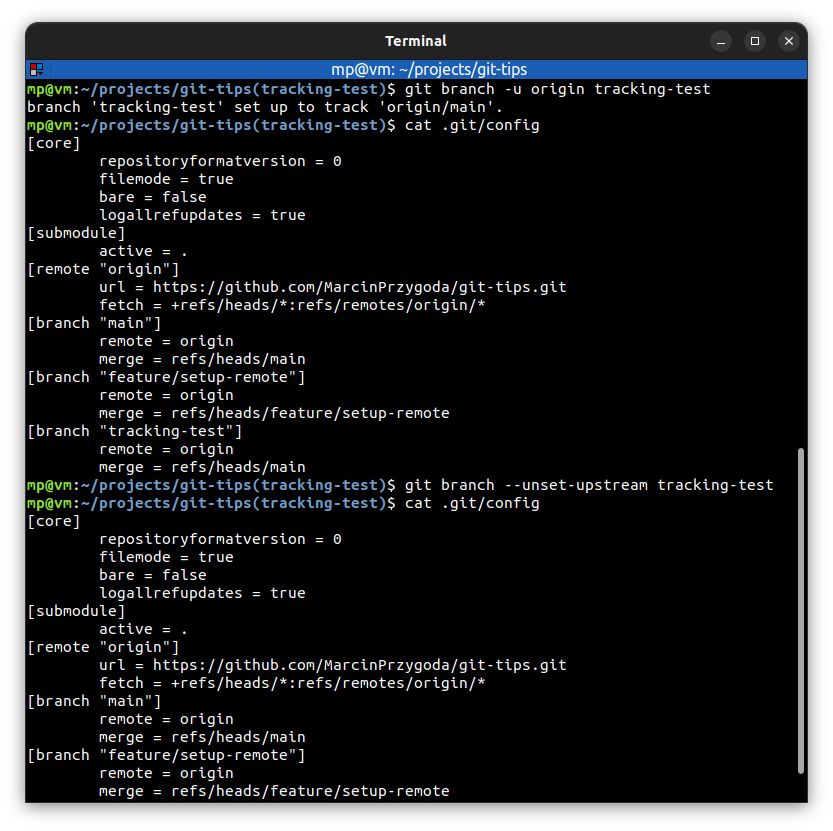

# 📋 TRACK REMOTE BRANCHES

| COMMAND                                | DESCRIPTION                                                                                                                                                                                                                          |
| -------------------------------------- | ------------------------------------------------------------------------------------------------------------------------------------------------------------------------------------------------------------------------------------ |
| `git push -u <repository> <branch>`    | pushes committed changes on `<branch>` into remote `<repository>`. Use `-u` option to add upstream (**tracking**) reference, especially when you're creating a `<branch>` for the first time [🔗](#git-push-without-setting-upstream) |
| `git branch -u <upstream> <branch>`    | set `<upstream>` (**tracking**) reference for `<branch>` [🔗](#set-and-unset-upstream)                                                                                                                                                |
| `git branch --unset-upstream <branch>` | unset upstream (**tracking**) reference for `<branch>` [🔗](#set-and-unset-upstream)                                                                                                                                                  |
| `cat .git/config`                      | show git config where tracking information for branch "`<branch>`" is stored                                                                                                                                                         |

Without tracking reference, we'll need to specify the remote branch **every single time** we want to interact with it (`push`/`fetch`/`pull`).

## 📌 Examples

### Git Push without setting upstream

### Set and unset upstream

