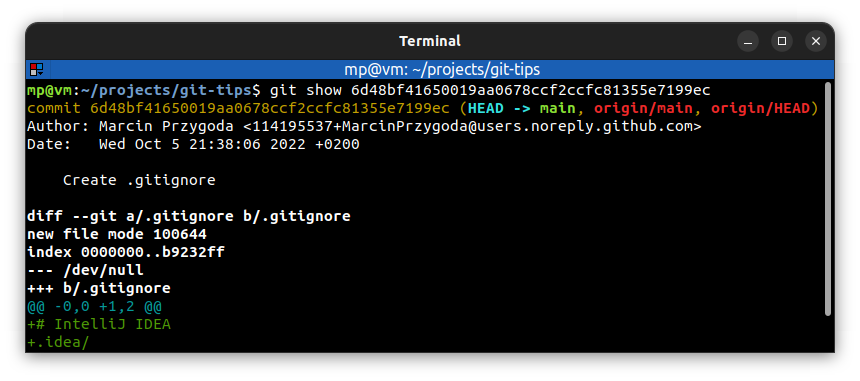
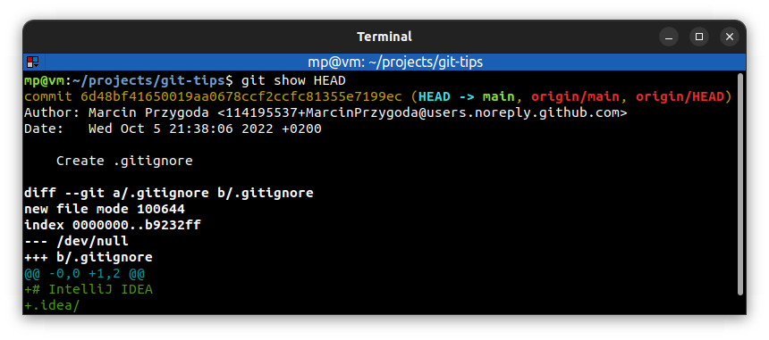

# 📋 TREE-ISH

A **tree** in Git is a directory containing files and other directories.

Git uses the term **tree-ish** to refer to both **trees** and **identifiers** which references a tree.

A commit is considered tree-ish, because it refers to a tree **at the point** when a commit has been done.

In simple terms, a tree-ish is a **directory** or something that **points to a directory** (including **commits**, **tags** and **branches**).

## 📌 Most common references

- SHA-1 hash:
  - Complete **40-character string** referencing a commit
  - We don't have to type all 40 characters: **4** or more are enough (usually **8-10** are used)
- HEAD pointer reference:
  - Reference to the **tip** of the current branch
  - It's similar to an **analog tape recorder**: it's where the play head is positioned for recording new commits
  - Usually it points to the commit that you made **last**, but it can be moved around
  - Git keeps track of where the head is pointed by using `.git/HEAD` **file** which usually refers to another file e.g. `.git/refs/heads/main` (when we're on `main` branch). It contains SHA-1 hash referencing a commit
- Branch reference
- [Tag reference](../commands/GIT-TAG.md)
- [Ancestry](ANCESTRY.md)

## 📌 Examples

We can use `git show` with **SHA-1 hash** (`git show 6d48` will also work):

We also can use `git show` with **HEAD pointer reference**:

