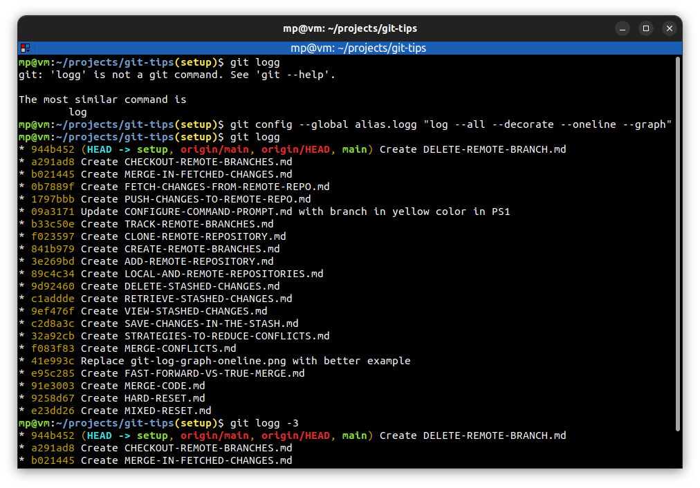

# 📋 GIT ALIASES

Git allows to create **aliases** for **commonly-used** commands.

| COMMAND                                          | DESCRIPTION                                                    |
| ------------------------------------------------ | -------------------------------------------------------------- |
| `git config --global alias.<alias> "<command>"`  | add `<alias>` for git `<command>` to `${HOME}/.gitconfig`      |
| `git config --global alias.<alias> "!<command>"` | add `<alias>` for external `<command>` to `${HOME}/.gitconfig` |

## 📌 Example

