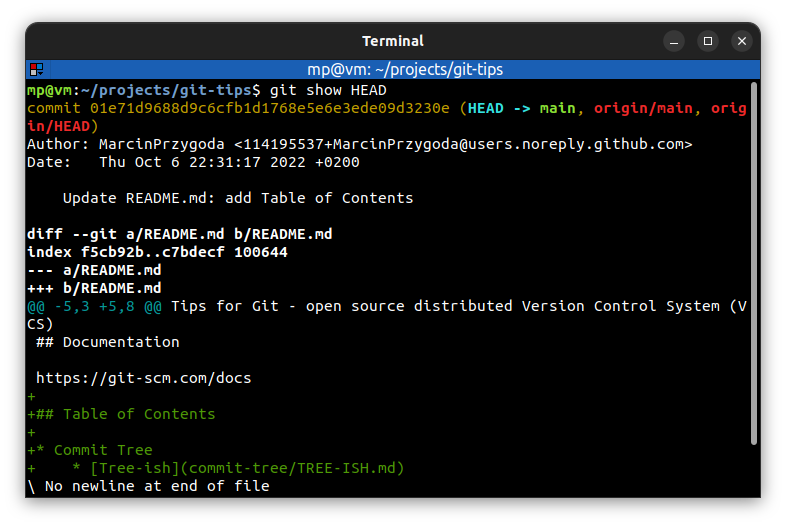
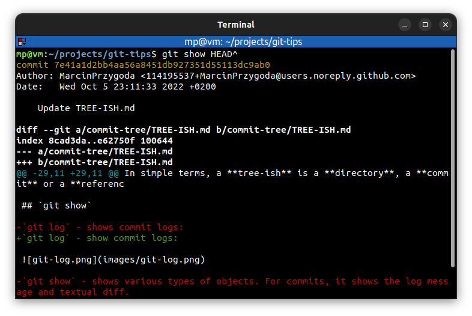
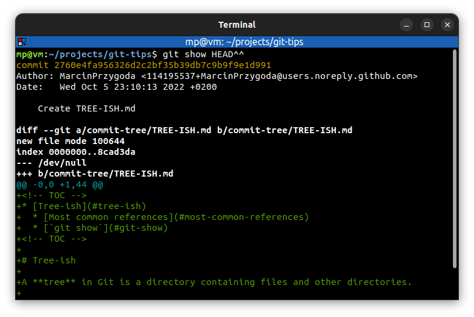

# 📋 ANCESTRY

Every commit **links** to the commit that comes before it. So, most commits are going to have a **parent commit**, a **grandparent commit**, and even a **great-grandparent commit**. This is **Ancestry**.

## 📌 Parents Ancestry [🔗](#parents-ancestry)

- `pl123456^` - SHA-1 hash with caret `^` symbol. Reference to parent of `pl123456` commit
- `main^` - reference to parent of the last commit in `main` branch
- `HEAD^` - reference to parent of `HEAD` commit
- `HEAD~1`, `HEAD~` - it is the same as `HEAD^`. The number `1` says "**go back one generation**". The number `1` is also **default** when not specified

## 📌 Grandparents Ancestry [🔗](#grandparents-ancestry)

- `pl123456^^` - reference to grandparent of `pl123456` commit
- `HEAD~2` - it is the same as `HEAD^^`. The number `2` says "**go back two generations**"

## 📌 Great-Grandparents Ancestry [🔗](#great-grandparents-ancestry)

- `pl123456^^^` - reference to great-grandparent of `pl123456` commit
- `HEAD~3` - it is the same as `HEAD^^^`. The number `3` says "**go back three generations**"

## 📌 Symbol usage

**Caret** `^` symbol should be used **for parents or grandparents ancestry**.

**Tilde** `~` symbol **with number** should be used when we need to **go back three or more generations** (as it is shorter than adding carets).

## 📌 Example

### Child

### Parents Ancestry

### Grandparents Ancestry

### Great-Grandparents Ancestry

