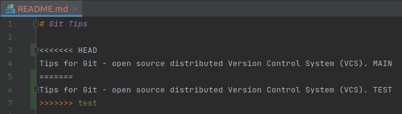

# 📋 MERGE CONFLICTS

**Merge conflict** occurs when there are **different changes on the same line on two different branches**. Git doesn't know what to do, so it will **mark the conflict** and then **wait for you** to fix the problem.

## 📌 How to resolve merge conflicts?

- Abort merge with: `git merge --abort`
- [Resolve merge conflicts manually](#-resolve-merge-conflicts-manually)
- [Resolve merge conflicts with a merge tool](#-resolve-merge-conflicts-with-a-merge-tool)

## 📌 Resolve merge conflicts manually

Prepare a merge conflict:

Automatic merge of `test` branch into `main` branch **failed** below.

The `main|MERGING` branch name indicates that we're **in the middle of a merge**.

**Conflict markers** flag merge conflicts:
- `<<<<<<< HEAD` - after this marker we have **our current branch** part
- `=======` - **splits two parts** on which we have merge conflicts
- `>>>>>>> <branch>` - before this marker we have **merging in branch** part

In order to resolve merge conflicts:
- **remove** conflict markers
- leave only **one version** of the line

After resolving all merge conflicts, finish merge with:
- `git add <file>` - marks merge conflict as **resolved**
- `git commit` - **concludes** merge

## 📌 Resolve merge conflicts with a merge tool

You can use `git mergetool` to run one of several **merge conflict resolution tools** to resolve merge conflicts. It is typically run **after** `git merge`.

If one or more `<file>` parameters are given, the merge tool program will be run to resolve differences on each file (skipping those without conflicts). Specifying a directory will include all unresolved files in that path. If no `<file>` names are specified, `git mergetool` will run the merge tool program on every file with merge conflicts.

| COMMAND                     | DESCRIPTION                                            |
| --------------------------- | ------------------------------------------------------ |
| `git mergetool -t <tool>`   | use the merge resolution program specified by `<tool>` |
| `git mergetool --tool-help` | list valid `<tool>` settings                           |

## 📌 Strategies to reduce merge conflicts

### Keep lines short

If lines are short:
- there are **less characters** in them
- it's **less likely** that something is going to conflict
- it's **easier to identify and fix** conflicts when they arise

### Keep commits small and focused

Don't make commits that are **enormous in scope**, especially if they contain files which are **not related to changes**. Instead, make a commit that does **one single thing**.

### Beware stray edits to whitespace (spaces, tabs, line returns)

Just **stick** with either spaces or tabs and don't make line returns **unnecessarily**.

### Merge often

Merge from your `feature` branch back into your `main` branch **as much as you can**.

Some developers use **feature flags**, so that the feature is present in the main code, but it's not turned on unless a certain flag is triggered. It's a technique that allows us to keep merging back in those `feature` branches into `main` regularly to reduce merge conflicts without actually activating the feature for the public.

### Track changes to `main`

It's a bit like merging often but **in reverse**.

Merging `main` branch periodically into your `feature` branches is a process called **tracking**.