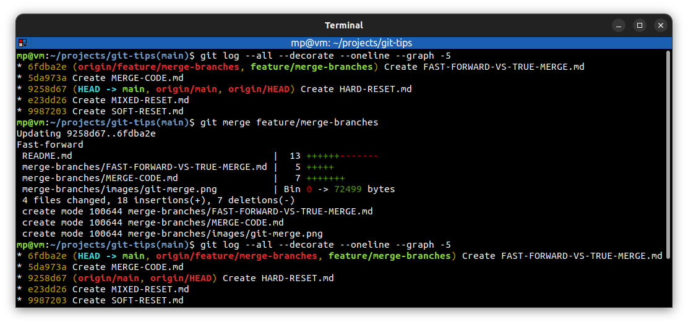
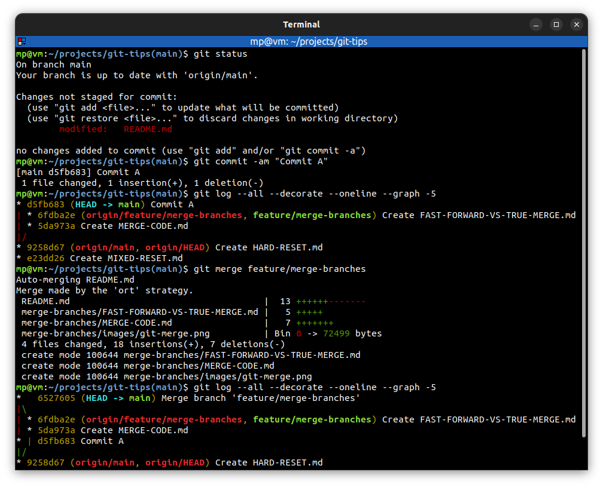

# Fast-forward vs true merge

**Fast-forward merge** does not make a new commit to merge things together. Git just simply **move** commits into the current branch.

**True merge** (or non-fast-forward merge) makes a new commit which joins two branches together. It is done, when one or more commits are done on current branch, but they're not present on merged branch.

Most of the time you'll **let git handle merge process** and decide whether it should be a fast-forward or non-fast-forward merge.