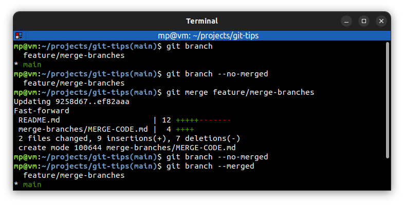

# ⭐ Merge code

Merge **joins** two or more development histories together.

| COMMAND              | DESCRIPTION                                             |
| -------------------- | ------------------------------------------------------- |
| `git merge <branch>` | merge changes from `<branch>` into current local branch |

## ⭐⭐ Examples

