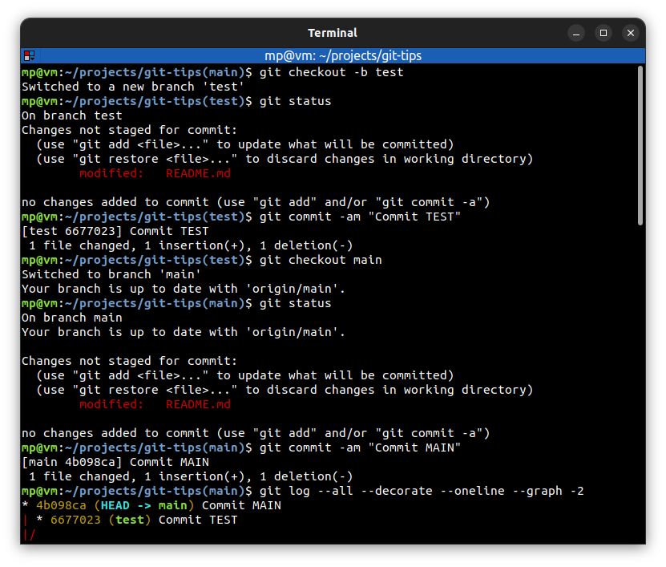
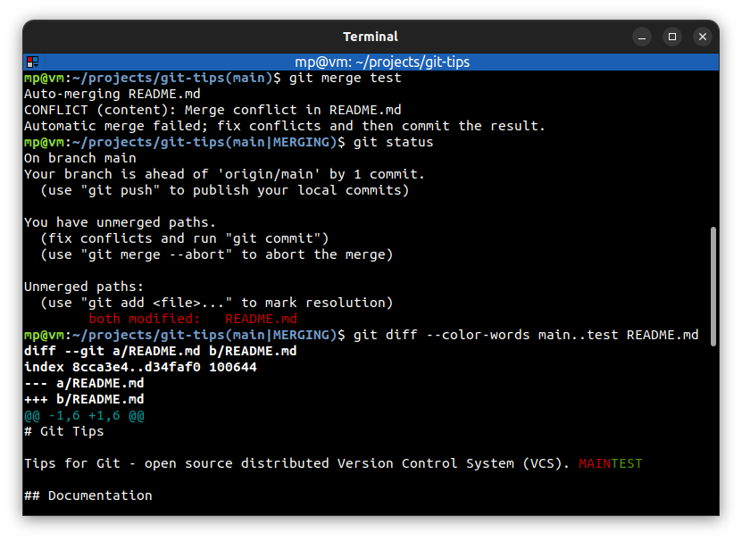
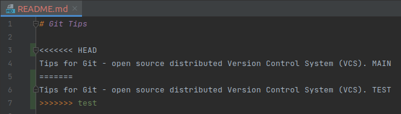
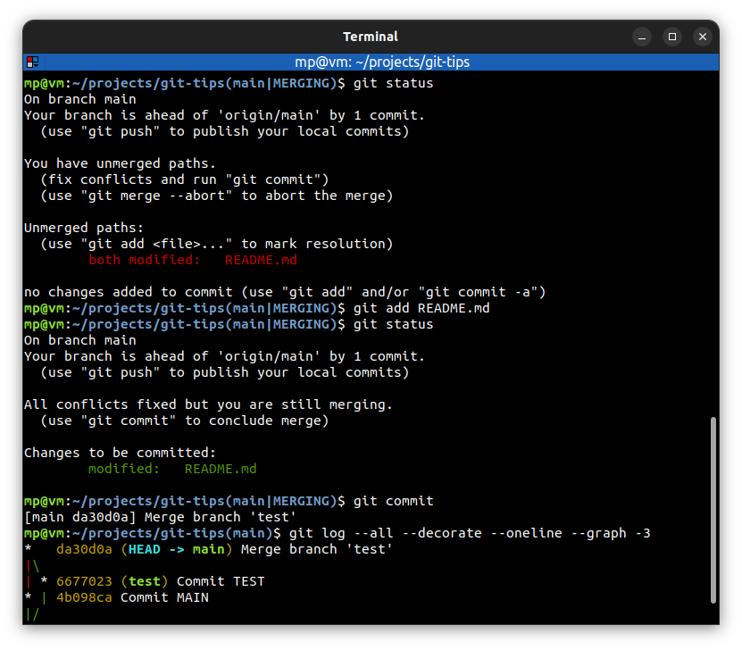

# Merge conflicts

**Merge conflict** occurs when there are **different changes on the same line on two different branches**. Git doesn't know what to do, so it will **mark the conflict** and then **wait for you** to fix the problem.

There are **three** ways that you can resolve merge conflicts:

- Abort merge with: `git merge --abort`
- [Resolve merge conflicts manually](#resolve-merge-conflicts-manually)
- [Resolve merge conflicts with a merge tool](#resolve-merge-conflicts-with-a-merge-tool)

## Resolve merge conflicts manually

Prepare a merge conflict:

Automatic merge of `test` branch into `main` branch **failed** below.

The `main|MERGING` branch name indicates that we're **in the middle of a merge**.

**Conflict markers** flag merge conflicts:
- `<<<<<<< HEAD` - after this marker we have **our current branch** part
- `=======` - **splits two parts** on which we have merge conflicts
- `>>>>>>> <branch>` - before this marker we have **merging in branch** part

In order to resolve merge conflicts:
- **remove** conflict markers
- leave only **one version** of the line

After resolving all merge conflicts, finish merge with:
- `git add <file>` - marks merge conflict as **resolved**
- `git commit` - **concludes** merge

## Resolve merge conflicts with a merge tool

You can use `git mergetool` to run one of several **merge conflict resolution tools** to resolve merge conflicts. It is typically run **after** `git merge`

If one or more `<file>` parameters are given, the merge tool program will be run to resolve differences on each file (skipping those without conflicts). Specifying a directory will include all unresolved files in that path. If no `<file>` names are specified, `git mergetool` will run the merge tool program on every file with merge conflicts

`git mergetool -t <tool>` - use the merge resolution program specified by `<tool>`

`git mergetool --tool-help` - list valid `<tool>` settings