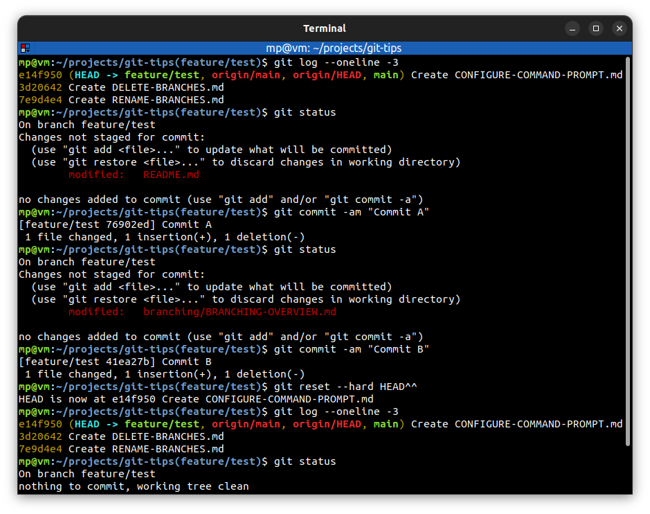
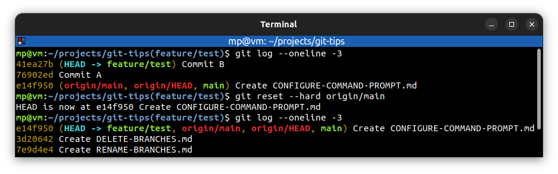

# Hard reset

* used to return to an old state and **discard** all code changes
* useful to **permanently undo** commits e.g. when you want to make one branch look like another
* previous commits and all changes will be **discarded**
* be careful about amending commits which have been **shared with others**

