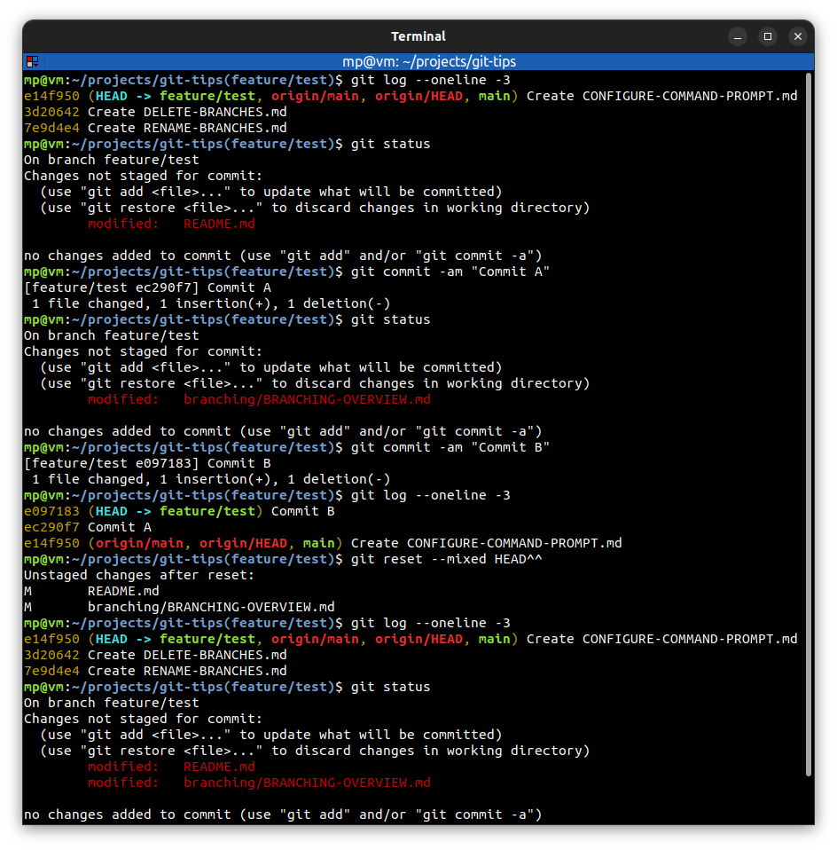

# Mixed reset

* used to return to an old state and leave code changes in working directory
* useful for **reorganizing** commits
* previous commits will be **discarded**
* be careful about amending commits which have been **shared with others**

