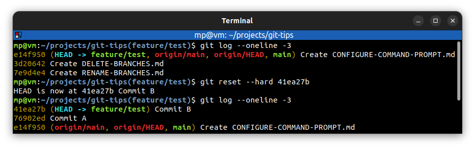

# Reset types

**Reset** changes the files in the **staging index** and/or **working directory** to the state they had when a **specified commit was made**. It moves **HEAD** pointer to a **specific commit**.

> "Make my project look like it did back then"

---
There are 3 types of reset:
* **[soft](SOFT-RESET.md)** - `git reset --soft <tree-ish>`:
  * moves HEAD pointer
  * does not change staging index
  * does not change working directory
* **[mixed](MIXED-RESET.md)** - `git reset --mixed <tree-ish>` (this is **default** option for `git reset`):
  * moves HEAD pointer
  * changes staging index to match repository
  * does not change working directory
* **[hard](HARD-RESET.md)** - `git reset --hard <tree-ish>`:
  * moves HEAD pointer
  * changes staging index to match repository
  * changes working directory to match repository

---
Most of the time you only want to do resets, when you're working in **your own private repository** and you have not pushed up those changes to **any remote repository** or shared it with **any collaborators**.

---
`git reset <commit-hash>` - undo `git reset` command: you can do it in **short term**. When we do a reset and there's nothing pointing at those commits that are later on, then git feels like it's able to delete them during **garbage collection**

