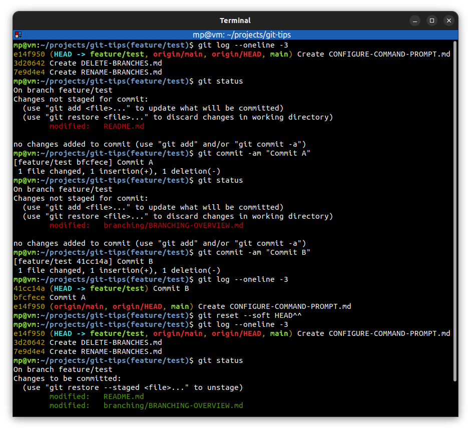

# Soft reset

* used to return to an old state and leave code changes **staged**
* useful for **amending** one or more commits
* similar to `git commit --amend`
* previous commits will be **discarded**
* be careful about amending commits which have been **shared with others**

Most of the time you only want to do resets, when you're working in **your own private repository** and you have not pushed up those changes to **any remote repository** or shared it with **any collaborators**.

