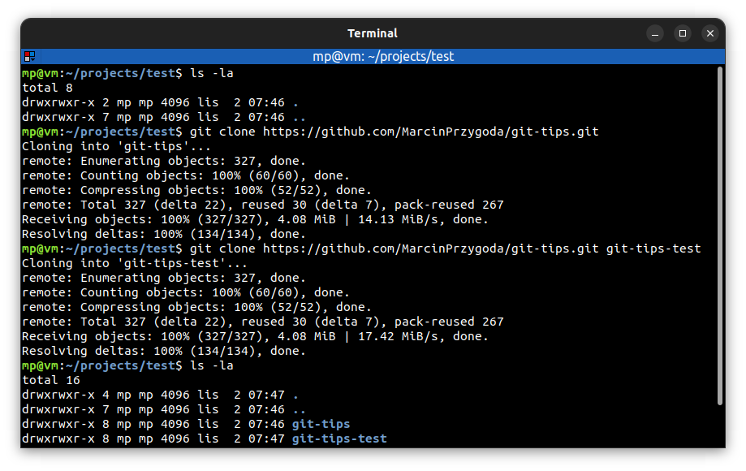

# ⭐ Clone remote repository

| COMMAND                 | DESCRIPTION                                                                                                                                    |
| ----------------------- | ---------------------------------------------------------------------------------------------------------------------------------------------- |
| `git clone <url> <dir>` | clone (copy) remote Git repository into local `<dir>`. If `<dir>` is not provided, repository is cloned under directory having repository name |

## ⭐⭐ Examples

