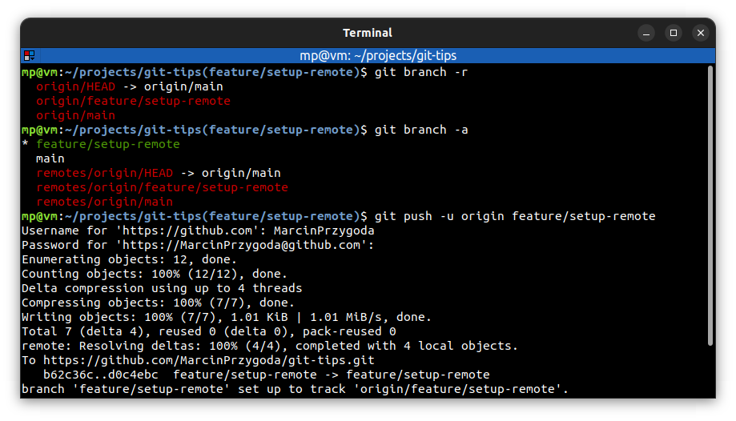

# ⭐ Create remote branches

| COMMAND                             | DESCRIPTION                                                                                                                                                                         |
| ----------------------------------- | ----------------------------------------------------------------------------------------------------------------------------------------------------------------------------------- |
| `git branch -r`                     | show a list of remote branches                                                                                                                                                      |
| `git branch -a`                     | show a list of both local and remote branches                                                                                                                                       |
| `git push -u <repository> <branch>` | pushes committed changes on `<branch>` into remote `<repository>`. Use `-u` (adds upstream, **tracking** reference) especially when you're creating a `<branch>` for the first time |

## ⭐⭐ Examples

