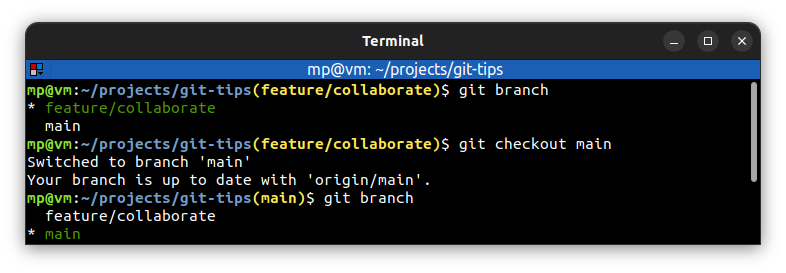

# 🔶 GIT PROMPT

**Git Prompt** is a program which adds the **current branch name** to command prompt.

## ▶️ Installation

| COMMAND     | DESCRIPTION                      |
| ----------- | -------------------------------- |
| `__git_ps1` | check if Git Prompt is installed |

If `__git_ps1` is not found, then download [`git-prompt.sh`](https://github.com/git/git/blob/master/contrib/completion/git-prompt.sh) script from `git` repository:
```bash
curl -Lo "${HOME}/.git-prompt.sh" "https://raw.githubusercontent.com/git/git/master/contrib/completion/git-prompt.sh"
```

## ▶️ Configuration

| COMMAND       | DESCRIPTION                                                                                                        |
| ------------- | ------------------------------------------------------------------------------------------------------------------ |
| `echo ${PS1}` | display current `PS1` (stands for "**Prompt String One**", the first prompt string that you see at a command line) |

In `~/.bashrc` add `$(__git_ps1 "(%s)")` after `\w` (below example adds additional colors):
```bash
export PS1='\[\e]0;\u@\h: \w\a\]${debian_chroot:+($debian_chroot)}\[\033[01;32m\]\u@\h\[\033[00m\]:\[\033[01;34m\]\w\[\033[00m\]\[\033[01;33m\]$(__git_ps1 "(%s)")\[\033[00m\]\$ '
```

or if Git Prompt has been [installed manually](#▶️-installation):
```bash
if [ -f ~/.git-prompt.sh ]; then
  source ~/.git-prompt.sh
  export PS1='\[\e]0;\u@\h: \w\a\]${debian_chroot:+($debian_chroot)}\[\033[01;32m\]\u@\h\[\033[00m\]:\[\033[01;34m\]\w\[\033[00m\]\[\033[01;33m\]$(__git_ps1 "(%s)")\[\033[00m\]\$ '
fi
```

## ▶️ Example

