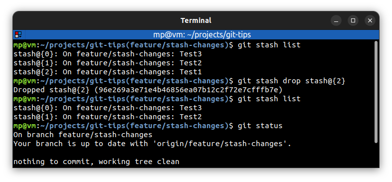
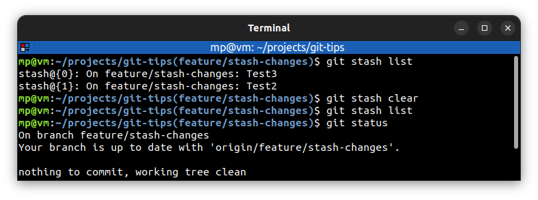

# ⭐ Delete stashed changes

| COMMAND                    | DESCRIPTION                                                                                                                                                       |
| -------------------------- | ----------------------------------------------------------------------------------------------------------------------------------------------------------------- |
| `git stash pop stash@{1}`  | **remove** a single stashed state from the stash list and **apply** it on top of the current working tree state, i.e., do the inverse operation of git stash push |
| `git stash drop stash@{0}` | **remove a single stash entry** from the list of stash entries                                                                                                    |
| `git stash clear`          | **remove all** the stash entries                                                                                                                                  |

## ⭐⭐ Examples

