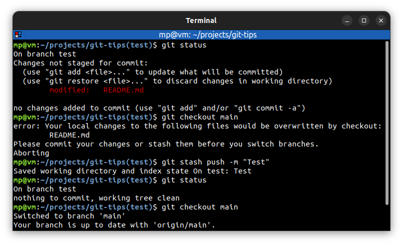
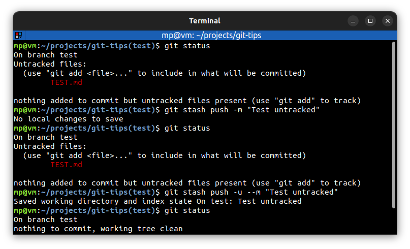

# ⭐ Save changes in the stash

Stashes are like a **little pocket** where you can put the changes and pull them out when you're ready.

The stash is not part of the repository, the staging index or the working directory. It's a special fourth area of Git, **separate from others**.

| Command                          | Description                                         |
| -------------------------------- | --------------------------------------------------- |
| `git stash push -m <message>`    | save changes in the stash excluding untracked files |
| `git stash push -u -m <message>` | save changes in the stash including untracked files |

## ⭐⭐ Examples

