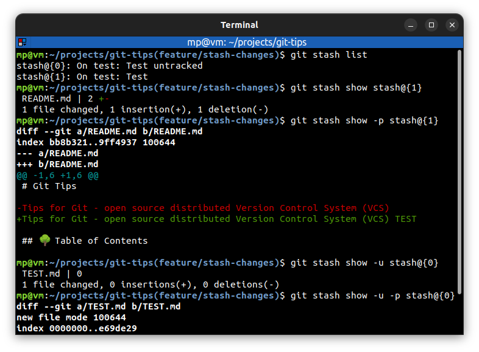

# ⭐ View stashed changes

| COMMAND                       | DESCRIPTION                                                              |
| ----------------------------- | ------------------------------------------------------------------------ |
| `git stash list`              | list the stash entries that you currently have                           |
| `git stash show stash@{1}`    | show the changes recorded in the stash entry                             |
| `git stash show -p stash@{1}` | show the changes recorded in the stash entry as a patch (actual changes) |
| `git stash show -u stash@{0}` | show the changes recorded in the stash entry including untracked files   |

Changes in the stash are independent of the branches that you're on. It means that stashes are available on all of the branches.

## ⭐⭐ Examples

